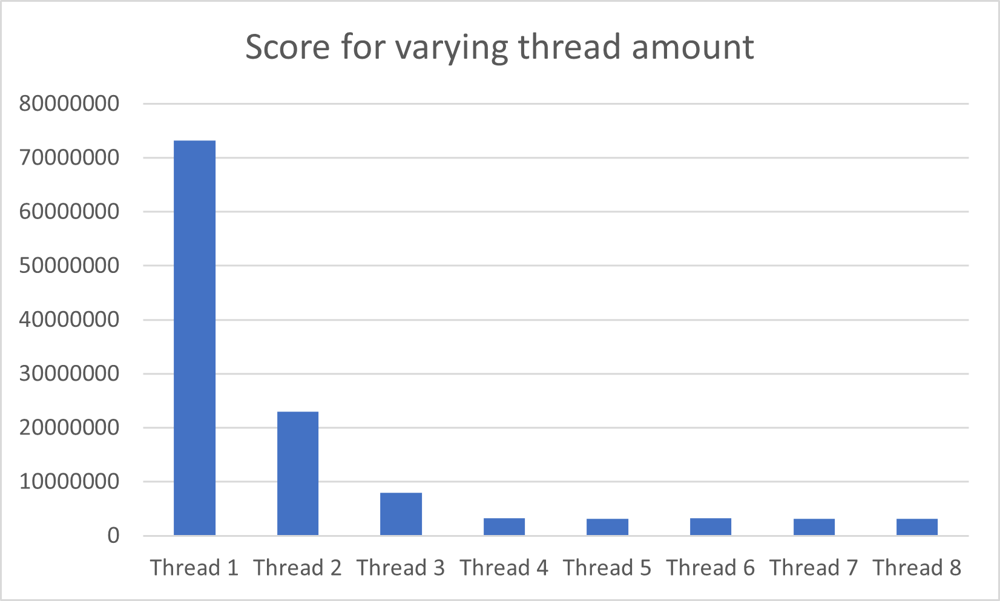
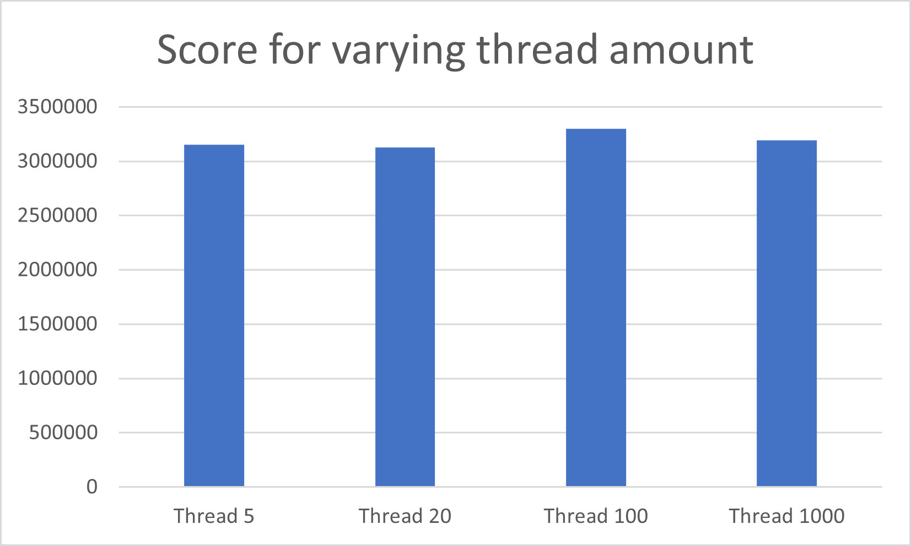

# os-challenge-softboys

In this project, we were tasked with implementing a linux server, which should handle various requests.
To do this, we implemented various features, to optimize the server in regards to speed and priority of requests.

## Priority queue
We implemented a priority queue system, to handle the given requests. This was done with a linked list, where the request with the highest priority is put closest to the head, and the least priority to the end. This makes the list sorted. A request is always taken from closest to head. 

To see how this feature affected the score, we tested it with one thread, to see how the priority queue affected the score. Without the priority queue, it just takes the newest request. That way, it works just like a stack. 

Priority queue: 100% reliability with a score of 135667709 points.  
Stack: 100% reliability with a score of 163875879 points. 

The difference is 28208170 points, which is a speedup of 17.21%. Keep in mind that this run by the vagrant from a local machine, and the score may differ if run on another machine. 

The difference is 4419840 points, which is very significant. 

## Threading Experiment
Once the linked list containing the request was implemented, we saw that the linked list was populated faster than the server could be able to handle. This gave rise to the idea that if we had multiple threads there would be enough request to have each thread continusly working. 

In this experiment we will implement a hash tread that takes a request from the prioty sorted linked list. It will then crack the hash and get a new one. The hash threads will be created in the main, and if a second argument after the port number is given to the sserve this will represent the number of threads created, this is to allow to test with a variyng amount of threads to find a optimal amount.

The experiment will test different amount of threads(from 1 to 8) to see what the optimal amount of threads is. The test will be done on the vagrant setup and run 4 times for each amount of threads. The run will be done on the milestone setup. The test has been condicted on the main branch on this hash `4bd8523126dee2fc39baf3dbaf587ee7dc376e78`.
The parementer for the client in the experiment is as follows:
- Total: 100
- Start: 0
- Difficulty: 30000000
- Repetition probability: 20%
- Delay: 600000
- Priority $\lambda$: 1.5

The above figure shows the avarage score at different thread amounts. It is here seen that as soon as the thread amount reaches 4 the score stop dropping. This was to be expected since the vagrant setup of the server has 4 CPU's. What is interesting is that the scores stays low above 4 threads and it dosent start to increase since it would be excpected that more threads would result in longer run time since the server would need more time to do context switching when the amount of threads is greater that the amount of CPU's on the server. This makes os aske the question what if we increase the amount of threads with a big amount.

On the above figure it can be seen that even incrasing the amount of threads to 1000 dosent have a score penealty due to have only 4 CPU's on the server. But if threads does not get a request they will go to sleep for 1 second, this might be the reason for wich there in not a penalty on the score, if threads would hve continualsy tried to get a request even though there was none, we would maybe have seen a much higher score for a 1000 threads.

Based on this experiment we can say that it is better to have more than 1 thread and based on the data we have chosen to go with 4 threads since more thrads does not yield a lower result.

## Spin locks vs Mutex
After the addition of threading into our server there was yet another case we had to take into consideration. Since all threads retrieve requests from the same list, the could be a case where multiple locks get access to the same request at the same time, leading to protential redundant and wasted computational power and likely memory errors.

For the first implentation we used spin locks in order to ensue only one thread had access to the request list at a time and then released the lokc whenever it was done retrieving. While in most tests is yielded 100% reliability there were some executions that were interrupted due to either race conditions where the program got stuck, or segmentation faults due to memory errors. This issue only showed itself whenever we set the request delay to an amout of time shorter than a thread could crack the hash.

We then decided to change the lock type to use mutexes instead since they are more reliable and don't have as much CPU overhead compared to spin locks, who are just stuck checking for a condition. 

#### Testing
In order to test whether there is a difference in time these were the parameters used for the client in each case:

- Total: 100
- Start: 0
- Difficulty: 30000000
- Repetition probability: 0%
- Delay: 600000
- Priority $\lambda$: 0

And the results were:

| | Score |
| :---: | :---:|
| Spin lock | 15561566 |
| Mutex | 15452852 |

There is a negligible difference in the score, which was expected since we used this experiment to improve reliability. But the results of the tests for reliability can't really be shown by the score difference, since sometimes with spilocks the server program would crash. However after implementing mutexes we didn't run into race conditions or segmentation faults due to access of the request list throughout the rest of the project.

With this we opted for using mutexes in our final solution.

## In-request threading
To come up with this experiment, we started thinking about what was the trade-off between optimizing the handling of different request with threading opposed to optimizing each individual request with threading. After further consideration of the experiment we also thought it could improve the score by giving higher priority requests lower response time, since there is a chance a high priority request comes in just as all threads started cracking other request leading to a relatively long response time with the other threading method.

This experiments includes the also implementation of the priority queue and caching. The experiment's implementation consists of a main thread that manages each individual request by splitting it up into a number of parts, which we will test to see which is more optimal, and have a child thread work each part of the fragmented request and try to find the solution. When all the child threads are done with their part the main thread returns the solution to the client and starts processing the next request. 

#### Setup
First in order to test the experiment and compare it with the other former threading implementation we set it up so that it was split into 4 parts and then tested it later with other values among themselves. 

First I ran the former implementation with 8 threads with the following parameters for the client:

- Total: 100
- Start: 0
- Difficulty: 30000000
- Repetition probability: 20%
- Delay: 600000
- Priority $\lambda$: 1.5

Afterwards I tested different parameters for amount of child threads but the same client configuration. Since we figured this method has an influence on the priority handling we also decided to run the experiment with Priority $\lambda$ = 1.3 and then = 1.0.

#### Results 
The resulting score of running the former implementation with 8 threads was 12582285 so I'll be using this as the parameter in order to conclude the outcome of the experiment.

The results of running with different amount of threads are shown in the following table:

| # Threads | Score |
| :---: | :---:|
| 2 | 151701544 |
| 4 | 63791141 |
| 6 | 62774341 |
| 8 | 63091071 |

The results of changing the priority were:
| $\lambda$ | Score |
| :---: | :---:|
| 1.5 | 63091071 |
| 1.3 | 64941635 |
| 1.0 | 57437576 |

#### Conclusion
In conclusion this experiment showed a great downgrade in comparison to the other threading implementation, this is likely due to the fact that for each request the time it takes is in theory constant, since all child threads have to finish before returning the result to the client even if they don't have the answer in the scope they were given. 

The implementation did show a very small improvement with a higher variety of priorities, but far from enough to justify implementing it in the final, solution in any way.

## Pseudo scheduling
On the continuous execution web page provided for the course we could see that the differce in run time between our implemenation and the best implementation amount to about 15 seconds, the fastest takes about a 100 seconds, so our implementation is 15% slower while having that is tre times as high. We think that this is due to the handeling of the priority.

An attempt at getting a higher score we had the idea that a thread with high priority should be handeled quickly. The issue we belive that we have at the moment is that when a new thread arives with a high priotity, we risk that all threads are occupied and the new request with high priority therefore have to wait for all threads to terminate before being handeled.

A scheduler works so that it chosses wich tasks to be executed at a certain time. Some schedulers also takes into account priority. In this experiment we will divide each incoming request into smaller segements and utilise the existing priority structure to store them. This means that when a request arives there is made a set of request in this experiment 4. Each containing a fouth of the search spectrum for the hash request. In this way a new incoming high priotiy thread will have to wait for a shorter duration of time before being handeled.

In this experiment we will test the pseudo scheduler against the main with 4 threads.
The parementer for the client in the experiment is as follows:
- Total: 100
- Start: 0
- Difficulty: 30000000
- Repetition probability: 20%
- Delay: 600000
- Priority $\lambda$: 1.5

Below is the avargea score after 5 runs with the above parameters.
| | Normal | Pseudo scheduling |
| :---: | :---:| :---:|
| Score | 3509427 | 4280612 |

From the result it can be seen that this new version of the server is indeed not faster that the old implementation. Threads would have to start and stop more frequently in this new version which would cost time. As this was implented after the hash cache, we would have believed that there was few drawbacks of dividing the request into smaller sub requests. But testing it seems like the issue is partially due to each request on avareage takes longer to calculate, beacuase if the result is found in one of the subrequests, other thread might be working on other subrequest originating from the same request. This issue is similar but not as bad as in the In-request threading experiment.

Beacuse of this implemenation not giving a better result than the original we have chosen not to keep this in the final implenation.