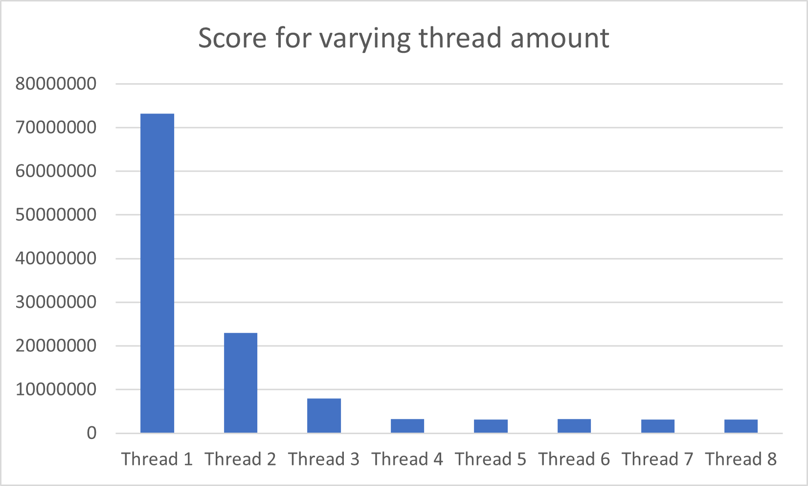
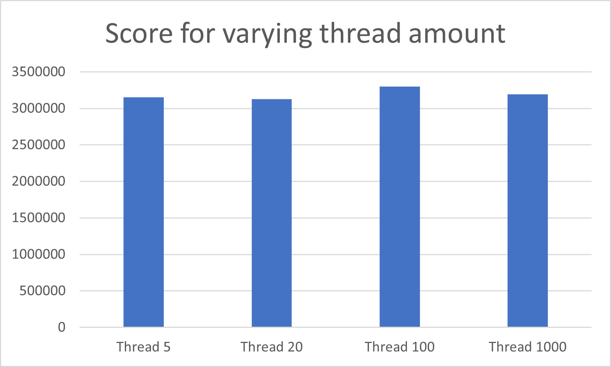
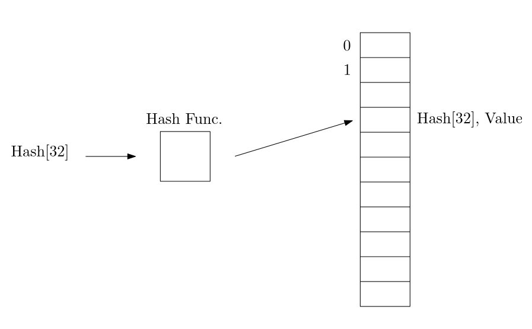
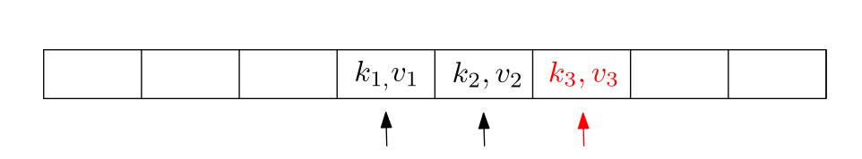
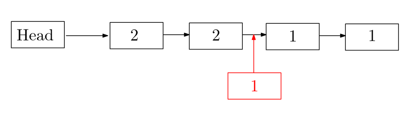

# os-challenge-softboys

In this project, we were tasked with implementing a Linux server, which should handle reverse hashing requests.

In our base implementation, we have a server which listens to a socket. When a request arrives it is stored in a linked list that acts like a stack. The server pops the request one by one and uses our reverse hash function to crack the hash. When the value for the hash is found it is sent back to the client.
The reverse hash itself is a loop that goes through from start to end of a request and tries all numbers in the interval to see if it is the value that generates the hash.

We have conducted a set of experiments to improve our server, the result of these is listed below. We will end up with a short description of the chosen solution.

Table of resposibles for experriments:
| Experiment | Resposible |
| :---: | :---:|
| Priority stack | Bastian |
| Threading experiment | Alexander |
| Mutex vs Spinlock | Victor |
| Hash cache | Theodor |
| Queue vs stack | Theodor |
| In request threading | Victor |
| Pseudo scheduling | Alexander |
| Priority thread | Bastian |

## Priority stack
We implemented a priority stack system, to handle the given requests. This was done with a linked list, where the request with the highest priority is put closest to the head, and the least priority to the end. This makes the list sorted. A request is always taken closest to the head. 

To see how this feature affected the score, we tested it with one thread, to see how the priority stack affected the score. Without the priority queue, it just takes the newest request. That way, it works just like a stack. 

Priority stack: 100% reliability with a score of 135667709 points.  
Stack: 100% reliability with a score of 163875879 points. 

The difference is 28208170 points, which is a speedup of 17.21%. Keep in mind that this is run by the vagrant from a local machine, and the score may differ if run on another machine. 

The difference is 4419840 points, which is very significant. 

## Threading Experiment
Once the linked list containing the request was implemented, we saw that the linked list was populated faster than the server could be able to handle. This gave rise to the idea that if we had multiple threads there would be enough requests to have each thread continuously working. 

In this experiment, we will implement a hash tread that takes a request from the priority sorted linked list. It will then crack the hash and start over with a new request from the linked list. The server creates the hash threads in the main function when a connection is established.

The experiment will test different numbers of threads(from 1 to 8) to see what the optimal amount of threads is. The test will be done on the vagrant setup and run 4 times for each amount of threads. The run will be done on the milestone setup. The test has been conducted on the main branch with the following hash `4bd8523126dee2fc39baf3dbaf587ee7dc376e78`.
The parameter for the client in the experiment is as follows:
- Total: 100
- Start: 0
- Difficulty: 30000000
- Repetition probability: 20%
- Delay: 600000
- Priority $\lambda$: 1.5

The above figure shows the average score at different thread numbers. It is here seen that as soon as the thread number reaches 4, the score stops dropping. This was to be expected since the vagrant setup of the server has 4 CPUs. What is interesting is that the scores stay low above 4 threads and they don't start to increase since it would be expected that more threads would result in a longer run time. We thought that it would be slower since the server would need more time to do context switching when the amount of threads is greater than the number of CPUs on the server. This makes us ask the question what if we increase the number of threads by a big amount?

In the above figure, it can be seen that even increasing the number of threads to a 1000 doesn't have a score penalty due to having only 4 CPUs on the server. But if threads do not get a request they will go to sleep for 1 second, this might be the reason why there is not a penalty on the score. If threads would have continuously tried to get a request even though there was none, we would maybe have seen a much higher score for a 1000 threads.

Based on this experiment we can say that it is better to have more than 1 thread and based on the data we have chosen to go with 4 threads since more threads do not yield a lower result.

## Spin locks vs Mutex
After the addition of threading into our server, there was yet another case we had to take into consideration. Since all threads retrieve requests from the same list, there could be a case where multiple threads get access to the same request at the same time, leading to potential redundant and wasted computational power and likely memory errors.

For the first implementation, we used spin locks to ensure only one thread had access to the request list at a time and then released the lock whenever it was done retrieving. While most tests yielded 100% reliability there were some executions that were interrupted due to either race conditions where the program got stuck, or segmentation faults due to memory errors. This issue only showed itself whenever we set the request delay to an amount of time shorter than a thread could crack the hash.

We then decided to change the lock type to use mutexes instead since they are more reliable and don't have as much CPU overhead compared to spin locks, which are just stuck checking for a condition. 

#### Testing
In order to test whether there is a difference in time these were the parameters used for the client in each case:

- Total: 100
- Start: 0
- Difficulty: 30000000
- Repetition probability: 0%
- Delay: 600000
- Priority $\lambda$: 0

And the results were:

| | Score |
| :---: | :---:|
| Spin lock | 15561566 |
| Mutex | 15452852 |

There is a negligible difference in the score, which was expected since we used this experiment to improve reliability. But the results of the tests for reliability can't really be shown by the score difference, since sometimes with spinlocks the server program would crash. However, after implementing mutexes we didn't run into race conditions or segmentation faults due to illegal accesses to the request list throughout the rest of the project.

For this reason, we opted for mutexes in our final solution.

## Experiment: Cache
Since there is a chance for the client to send the exact same hash multiple times to be reverse hashed, we thought it was obvious to try to implement some sort of cache. A cache could enable us to check if an incoming hash request from the client has already been computed and therefore improve the overall performance of the server.

### Implementation
The way we implemented the cache was with a hash table since we wanted to check if a hash has already been reversed to be as fast as possible. The run time of the search is constant time but this can be longer depending on the number of collisions. Collisions are when the hash function evaluates the hash to the same index.

We, therefore, had to implement **probing**. We implemented linear probing which is where we increase the index by 1 until we find a free spot. To decrease the number of collisions we designed the hash table to also double the size of elements in the hash table.   

### Results
Running the milestone client program with and without the cache implementation we get the following results:

    Without cache: 100%, 23439259 score
    With cache: 100%, 18655014 score 
    Difference: 4784245

The repetition probability for the milestone is 20% and if we look at the difference between the two scores we see a decrease of approximately 20%. So in conclusion the implementation of the cache significantly increases the speed of our server.

## Queue or Stack Experiment
The way we originally implemented the linked list for storing the incoming request was with the style of a stack. So when we insert a new request into the linked list, we check the request starting from the head and comparing the priority. Whenever the request we are trying the insert is greater than the one we are comparing, then we place it in front of that.

We then thought of testing a queue style to see if it made a difference in the performance. So whenever we try to insert a new request, if there is a sequence of requests with the same priority level in the linked list, it will place it at the end of this sequence. This will act more like a queue, with the FIFO("First in first out") principle.

### Test
We did a test with both variations and got the following results from running the milestone with 20 requests:

    Stack: 43823126
    Queue: 43996520

### Conclude 
This is approximately the same score and there could be slowdowns for other reasons. We think this result makes sense since the average score is based on the latency and the priority of the requests and the order of handling requests as stack or queue will give the same average latency. Therefore it makes no difference as long as we handle requests with higher priority before low priority.

## In-request threading
To come up with this experiment, we started thinking about what was the trade-off between optimizing the handling of different requests with threading as opposed to optimizing each individual request with threading. After further consideration of the experiment we also thought it could improve the score by giving higher priority requests lower response time, since there is a chance a high priority request comes in just as all threads started cracking other requests leading to a relatively long response time with the other threading method.

This experiment also includes the implementation of the priority queue and caching. The experiment's implementation consists of a main thread that manages each individual request by splitting it up into several parts, which we will test to see which is more optimal and have a child thread work each part of the fragmented request and try to find the solution. When all the child threads are done with their part the main thread returns the solution to the client and starts processing the next request. 

#### Setup
First in order to test the experiment and compare it with the other former threading implementation we set it up so that it was split into 4 parts and then tested it later with other values among themselves. 

First I ran the former implementation with 8 threads with the following parameters for the client:

- Total: 100
- Start: 0
- Difficulty: 30000000
- Repetition probability: 20%
- Delay: 600000
- Priority $\lambda$: 1.5

Afterwards, we tested different parameters for the number of child threads but the same client configuration. Since we figured this method has an influence on the priority handling we also decided to run the experiment with Priority $\lambda$ = 1.3 and then = 1.0.

#### Results 
The resulting score of running the former implementation with 8 threads was 12582285 so I'll be using this as the parameter in order to conclude the outcome of the experiment.

The results of running with different numbers of threads are shown in the following table:

| # Threads | Score |
| :---: | :---:|
| 2 | 151701544 |
| 4 | 63791141 |
| 6 | 62774341 |
| 8 | 63091071 |

The results of changing the priority were:
| $\lambda$ | Score |
| :---: | :---:|
| 1.5 | 63091071 |
| 1.3 | 64941635 |
| 1.0 | 57437576 |

#### Conclusion
In conclusion, this experiment showed a great downgrade in comparison to the other threading implementation, this is likely due to the fact that for each request the time it takes is in theory constant since all child threads have to finish before returning the result to the client even if they don't have the answer in the scope they were given. 

The implementation did show a very small improvement with a higher variety of priorities, but far from enough to justify implementing it in the final solution in any way.

## Pseudo scheduling
On the continuous execution web page provided for the course we could see that the difference in run time between our implementation and the best implementation amount to about 15 seconds, the fastest takes about 100 seconds, so our implementation is 15% slower while having a score that is three times as high. We think that this is due to the handling of the priorities.

In an attempt at getting a higher score, we had the idea that a thread with high priority should be handled quickly. The issue we believe that we have is that at the moment when a new thread arrives with a high priority, we risk that all threads are occupied and the new request with high priority, therefore, have to wait for a thread to terminate before being handeled.

A scheduler works so that it chooses which tasks to be executed at a certain time. Some schedulers also take into account priority. In this experiment, we will divide each incoming request into smaller segments and utilise the existing priority structure to store them. This means that when a request arrives there is made a set of requests in this experiment 4. Each contains a fourth of the search interval for the hash request. In this way, a new incoming high-priority thread will have to wait for a shorter duration of time before being handled.

In this experiment, we will test the pseudo scheduler against the main with 4 threads.
The git branch for this experiment is the newest commit on the prioritythread branch.
The parameter for the client in the experiment is as follows:

- Total: 100
- Start: 0
- Difficulty: 30000000
- Repetition probability: 20%
- Delay: 600000
- Priority $\lambda$: 1.5

Below is the average score after 5 runs with the above parameters.
| | Normal | Pseudo scheduling |
| :---: | :---:| :---:|
| Score | 3509427 | 4280612 |

From the result, it can be seen that this new version of the server is indeed not faster than the old implementation. Threads would have to start and stop more frequently in this new version which would cost time. As this was implemented after the hash cache, we would have believed that there were few drawbacks of dividing the request into smaller sub-requests. But testing it seems like the issue is partially due to each request on average takes longer to calculate, because if the result is found in one of the other subrequests, other threads might be working on other subrequests originating from the same request. This issue is similar but not as bad as in the In-request threading experiment.

Because this implementation not giving a better result than the original implementation we have chosen not to keep this in the final implementation.

## Priority Threads 
To prioritize the requests with a priority level of 2 and higher, we tried having a number of separate threads only take those requests. That way, as soon as a request with a higher priority was available, there wouldn't be any delay to start working on it right away. There would still be threads working on the requests with priority level 1.
To see how this feature affected the score, we tested it with a different number of priority threads, that only take prioritized requests, and 4 threads handling requests with priority level 1. In the case of 0 priority threads, the 4 threads work like the priority stack.

0 priority threads: 100% reliability with a score of 16715531 points.  
1 priority thread: 100% reliability with a score of 16723936 points.  
2 priority threads: 100% reliability with a score of 16924651 points.  
3 priority thread: 100% reliability with a score of 17502895 points.  
4 priority thread: 100% reliability with a score of 17721286 points. 

It can be seen, that by increasing the number of priority threads, the score worsens, and having one priority thread is nearly identical to having none. Therefore, we didn't implement this feature in the final product.

## Final Solution
In our final server, we have a priority sorted stack to hold incoming requests.
The server has 4 threads that are dedicated to poping items from the stack and handling the requests.
Each found solution is stored in a hash cache that both the main server thread and the hash treads can access to check if a hash has already been calculated.
