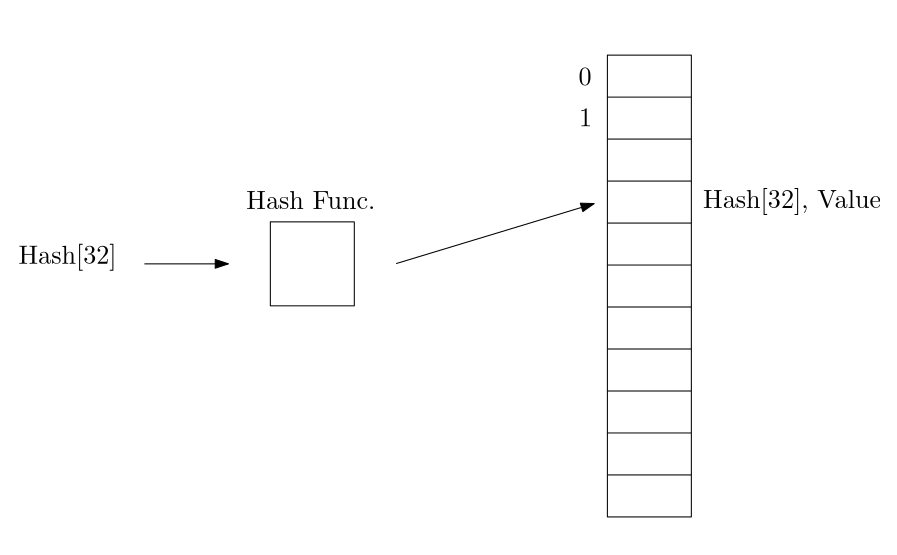
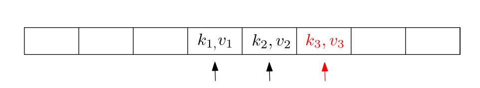

# os-challenge-softboys

## Experiment: Cache
Since there is a chance for the client to send the exact same hash multiple
times to be reverse hashed, we thought it was obvious to try to implement some sort of cache. A cache could enable us to check if an incoming hash request from the client has already been computed and therefore improve the overall performance of the server.

### Implementation
The way we implemented the cache was with a hash table, since we wanted the search for if a hash has already been reversed to be as fast as possible. The run time of the search is constant time but this can be longer depending on the number of collisions. Collisions are when the hash function evalutates the hash to the same index.

We therefore had to implement **probing**. We implemented linear probing which is where we increase index by 1 until we find a free spot. To decrease the number of collisions we designed the hash table to also double the size of elements in the hash table.   

### Results
Running a the milestone client program with and without the cache implementation we get the following results:

    Without cache: 100%, 23439259 score
    With cache: 100%, 18655014 score 
    Difference: 4784245

The repetition probability for the milestone is 20% and if we look at the difference between the two scores we see decrease in approximatly 20%. So in conclusion the implementation of the cache significantly increase the speed of our server.

