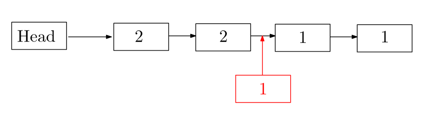
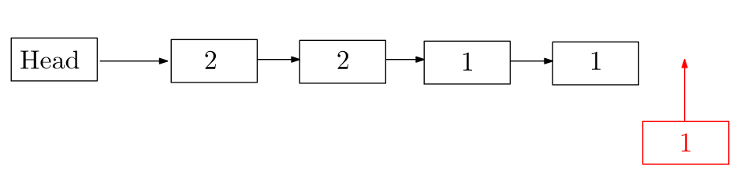

# os-challenge-softboys

In this project, we were tasked with implementing a linux server, which should handle various requests.
To do this, we implemented various features, to optimize the server in regards to speed and priority of requests.

## Priority queue
We implemented a priority queue system, to handle the given requests. This was done with a linked list, where the request with the highest priority is put closest to the head, and the least priority to the end. This makes the list sorted. A request is always taken from closest to head. 

To see how this feature affected the score, we tested it with 4 threads and with cache, to see how the priority queue affected the score. Without the priority queue, it just takes the newest request. That way, it works just like a stack. 

Priority queue: 100% reliability with a score of 17634707 points.  
Stack: 100% reliability with a score of 22054547 points. 

The difference is 4419840 points, which is very significant. 

## Queue or Stack Experiment
The way we originally implemented the linked list for storing the incoming request was with the style of a stack. So when we insert a new request into the linked list, we check the request starting from the head and comparing the priority. Whenever the request we are trying the insert is greater than the one we are comparing, then we place it infront of that.

We then thought of testing a queue style to see if it made a difference in the performance. So whenever we try to insert a new request, if there a is a sequence of request of the same priority level in the linked list, it will place it at the end of this sequence. This will act more like a queue, with the FIFO("First in first out") principle.

We did a test with both variations and got the following results:

    Stack: 43823126
    Queue: 43996520

This is approximatly the same score and there could be slowdowns for other reasons. We think this result makes sense since ...